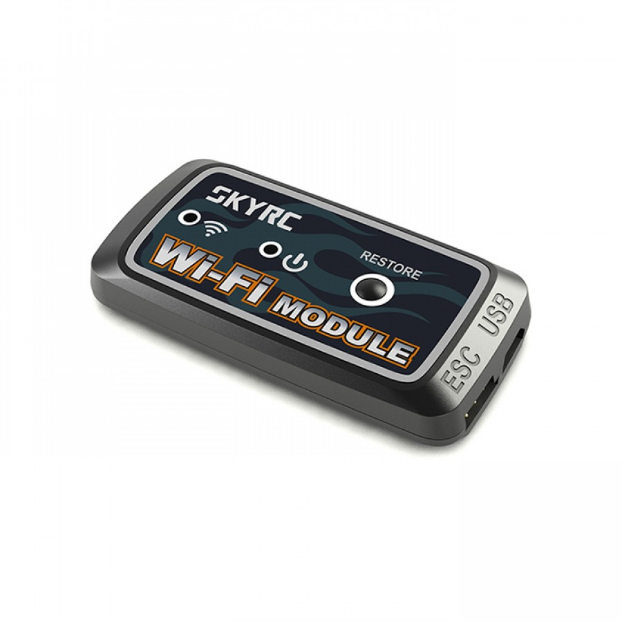

# skyrc-wifi



`skyrc-wifi` is a C library for discovering and communicating with SkyRC Wi-Fi battery chargers over UDP. It can discover chargers on a local network, read charger status and telemetry, start or stop charge/discharge programs, read or change supported settings, and scan/configure the charger's Wi-Fi connection.

## Supported charger families

- D100 and D200 (two channels, A and B)
- B6 Mini, B6AC, and B6AC Plus (single channel)
- W1000 (single channel)

Discovery identifies these families from the device identifier. Direct connections can be made by numeric IP address or hostname; callers may supply a model family when it is not discovered.

## Capabilities

- Broadcast discovery on IPv4 UDP port `8888`, and parse charger identity, name, MAC, firmware, password, mode, and IP address.
- Connect to chargers over IPv4 or IPv6 UDP port `8888`.
- Read current program state, channel information, system configuration, live voltage/current/capacity/temperature/cell measurements, and reported error bytes.
- Start and stop supported charge/discharge programs. The library exposes model-specific battery types and mode names.
- Read and update supported charger settings, including beeps, capacity and time protection, rest time, and temperature threshold.
- Scan nearby Wi-Fi networks and configure the charger to join a network.

The API is declared in [`include/skyrc-wifi.h`](include/skyrc-wifi.h). Charger communications are UDP request/reply operations; callers should allow for network timeouts and check every returned `enum skyrc_error` value. Functions that issue start, stop, or setting commands change charger state.

## Build

Requirements: CMake 3.15 or newer, a C23 compiler, and `json-c` development files discoverable by CMake.

The build requires a semantic version. It uses the latest Git tag by default; for a source archive or checkout without a tag, set `LIBSKYRC_VERSION`:

```sh
cmake -S . -B build -DLIBSKYRC_VERSION=4.2.0
cmake --build build
```

If the checkout has a Git tag, the version can be inferred instead:

```sh
cmake -S . -B build
cmake --build build
```

The shared library is written to `bin/` as `libskyrc-wifi.so` (with versioned names/links determined by CMake). The header is suitable for C and C++ callers.

## Basic use

This example connects to a charger at a known address, prints its model, then releases the device handle. Replace the address with the charger's numeric IP address.

```c
#include <skyrc-wifi.h>
#include <stdio.h>

int main(void)
{
    skyrc_device *device = NULL;
    if (!skyrc_open_device("192.168.1.50", &device)) {
        fprintf(stderr, "Could not connect to charger\n");
        return 1;
    }

    printf("Model family: %d at %s\n", skyrc_device_get_type(device), skyrc_device_get_ip(device));
    skyrc_free_item(device);
    return 0;
}
```

Link applications with `libskyrc-wifi` and `json-c` (and make the generated library discoverable by the runtime linker). For discovery, call `skyrc_start_listen()`, `skyrc_send_broadcast()`, and `skyrc_find_device()`, then close the listener with `skyrc_stop_listen()`. The listener API returns either a socket descriptor or a positive error code; because those ranges can overlap for low descriptor numbers, check the implementation's error constants and your platform's descriptor allocation when handling listener creation failures.

For a direct connection, use `skyrc_open_device()` with a hostname or numeric address, then call query/control functions and release the handle with `skyrc_free_item()`. The device handle owns its socket and discovered metadata. Opaque result objects have their own `*_create()` / `*_free()` lifecycle; getter strings are borrowed and remain valid only while the device handle is alive.

## Notes

- Discovery uses an IPv4 broadcast and binds UDP port `8888`; the process must be able to bind that port and broadcast on the local network.
- Most models support channel A only. D100/D200 expose channel-aware status and system information for A and B.
- `skyrc_request_current_state()` and other read functions retrieve data from the charger; corresponding `skyrc_device_get_*()` calls copy cached results into caller-created result objects.
